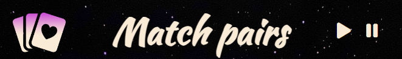

# Match Pairs
Dive into a realm of shadows and enchantment with our dark fantasy online memory game.
This immersive experience challenges your mind as you match pairs of hauntingly beautiful images, each steeped in mystery and allure. Unravel the secrets of the dark world while sharpening your memory skills, all from the comfort of your home. Perfect for those who crave a blend of strategy and storytelling, this game promises to captivate and thrill with every turn.

[View the live project here](https://anna-exe.github.io/match-pairs/)

##  Responsiveness
The site is responsive for all screen sizes

## Table of contents:
* [**Site Overview**](#site-overview)
* [**Planning stage**](#planning-stage)
* [**Features**](#features)
* [**Future-Enhancements**](#future-enhancements)
* [**Testing Phase**](#testing-phase)
* [**Deployment**](#deployment)
* [**Forking the GitHub Repository**](#forking-the-gitHub-repository)
* [**Local Clone**](#local-clone)
* [**Credits**](#credits)

### Planning stage
* Target audiences:
    - Individuals who have interest for short online games that is training their memory
    - Individuals who see beauty in dark fantasy arts
    - Individuals who love ambient music that is giving an immersive experience while playing the game

* As a user, I would expect:
    - Undestanding what is this website about from first seconds
    - Design that would please the eye
    - Understand the rules of game quickly
    - Game to be easy to start
    - Easy to manipulate throughout the game
    - Recieve a reward message on competition
    - Button to restart a game

* Wireframe

    

### Features
* Header consists of:
    - Logo icon that represents picture of card game
    - Name of the game
    - Backgound music controls for immersive experience

* Game container:
    - Rule of the game
    - Cards turned with backface to player
    - Game that checks if card matches the chosen image
